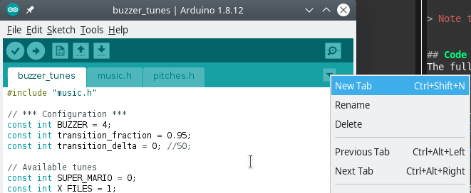

# Playing Music with a Buzzer

Today we'll learn what we can do with a piezo buzzer. First, we'll learn about the buzzer and then learn how to control it with Arduino.


A *piezo buzzer* is a cute and simple component that can generate sound in different frequencies. The sound is generated when current runs through the buzzer and causes its 2 flat disks to vibrate against each other. Different vibration frequencies will generate sound in different pitches.

Based on this description, you see that a buzzer cannot play multiple sounds at a time, nor can it play recordings or real music. Nonetheless, a buzzer is a very useful component and can be a lot of fun. Today we're going to play popular tunes with a buzzer.

> Anecdote: Active buzzers have a sticker on the top saying "Remove after washing". This refers to industrial settings. The washing process is what industrial systems to do remove flux residue on the board after soldering and before finishing production. The sticker is there to protect the hole on the top of the buzzer.
> Don't wash it, you can just remove

> Note that when you remove the sticker, the buzzer will be louder 


## Code
The full project is available at [buzzer_tune/buzzer_tune.ino](buzzer_tune).


There are 2 functions to control a buzzer with an Arduino:
- `tone(<buzzer_pin>, <frequency>)`
  or in the 3 argument version `tone(<buzzer_pin>, <frequency>, <duration>)`
- `noTone(<buzzer_pin>)`
   This function stops the buzzer from buzzing.

The first method sends the needed signal to the buzzer to make sound in the requested frequency. This is done by sending different voltage to the pin connected to the buzzer.
The second method stops sending voltage to the buzzer, and makes it silent.


Except for playing different frequencies, you might also want to change the volume. We have a component that can help with it (potentiometer or a POT), but we will not do it in this project.


### Working with Multiple Files
For this project, it'll be more convenient to separate the code into multiple files. In Arduino IDE, you add a new file by creating a new tab, and than naming it.



The files are not automatically included in your main project file, and you need to use the `include` directive to add them:

```c
#include "music.h"  // local files
#include <stdio.h>  // libraries from include path
```

In `buzzer_tune`, we have 2 additional files:
- `pitches.h` containing a long mapping of of frequencies to the note name.
- `music.h` containing a couple of songs, stored as arrays of `int` for frequencies and the length of the sound.


## Components
Generic requirements:

- Breadboard
- Arduino
- mini USB cable
- Jumper wires

Project specific needs:
- 100Ω resistor
- Piezo Buzzer


## Circuit Diagram
Just like last week


## Recap
- [ ] Buzzer mechanics
- [ ] Using built-in functions: `delay` and `tone`
- [ ] Adding multiple files to Arduino project
