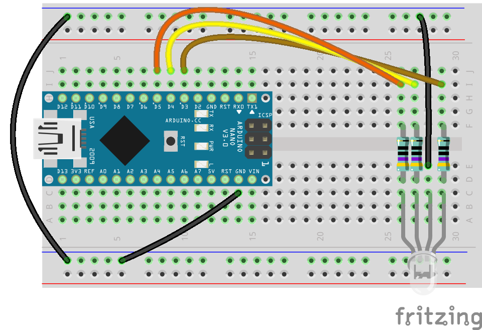
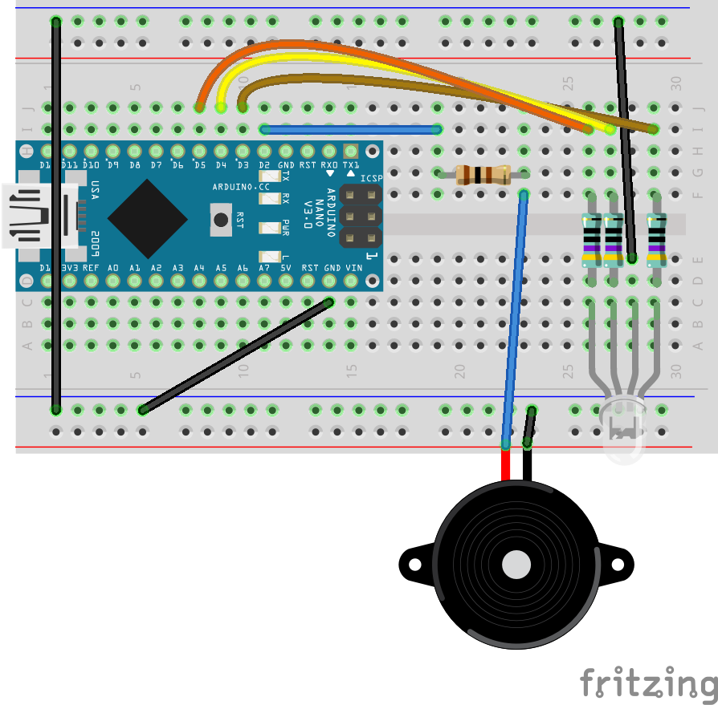

# Playing Music with a Buzzer

Today we'll learn about the pieze busser and then learn how to control it with Arduino.


A *piezo buzzer* is a cute and simple component that can generate sound in different frequencies. The sound is generated when voltage runs through the buzzer and causes its 2 flat disks to vibrate against each other. Changes in shape of the signal will cause the disks to vibrate in different frequences, and generate sound in different pitches.

Based on this description, you see that a buzzer cannot play multiple sounds at a time, nor can it play recordings or real music. Nevertheless, a buzzer is a very useful component and can be a lot of fun. Today we're going to play popular tunes with a buzzer.

> Active buzzers have a sticker on the top saying "Remove after washing". This refers to industrial settings. After machine soldering, there's flux residue that's being removed in the washing process. The sticker is there to protect the disks that have an opening at the top of the buzzer.
> Note that when you remove the sticker, the buzzer will be louder


## RGB LED
To make this project nicer, we'll also add an RGB LED. RGB LEDs are like 3 LEDs in one: it has 4 pins: 1 pin for ground (GND) and the other 3 for red (R), blue (B) and green (G).
Becasue we control each of RGB pins separately, we'll need to use 3 resistors, one for each pin, and connect it to 3 different pins on the Arduino.

### Circuit Diagram for RGB LED
You'll need (in addition to our generic components):
- 1 RGB LED
- 3 x 470Ω resistors. Any resistor between 200 - 1K will work, the higher the resistance the dimmer the light will be (making it dimmer is not a bad idea when playing with a breadboard close to the eyes)




### Code for RGB LED Example
The full project is available at [rgb_led_example/rgb_led_example.ino](rgb_led_example).

The code is pretty simple, just flashing all 3 LEDS one by one. From Arduino/code perspective, there's no difference between having 3 distinct LEDs or having one RGB LED, it is treated in exactly same in code. The visual effect can be different: instead of multiple LEDs lighting, the same LED will be changing colors.

```c
/**
 * RGB LED test example
 */

// *** Configuration ***
const int LED_R = 3;
const int LED_G = 4;
const int LED_B = 5;
// ***

int leds[] = {LED_R, LED_G, LED_B};

void setup() {
  for (int i = 0; i < 3; i++) {
    pinMode(leds[i], OUTPUT);
  }
}

void loop() {
  // flash leds in order
  for (int i = 0; i < 3; i++) {
    digitalWrite(leds[i], HIGH);
    delay(500);
    digitalWrite(leds[i], LOW);
  }
  delay(1000);
}
```


After mastering RGB LED programming we can move on to the main project.

## Code
The full project is available at [buzzer_tune/buzzer_tune.ino](buzzer_tune).


There are 2 functions to control a buzzer with an Arduino:
- `tone(<buzzer_pin>, <frequency>)`
  or in the 3 argument version `tone(<buzzer_pin>, <frequency>, <duration>)`
- `noTone(<buzzer_pin>)`
   This function stops the buzzer from buzzing.

The first method sends the needed signal to the buzzer to make sound in the requested frequency. This is done by sending different square wave to the pin connected to the buzzer.
The second method stops sending voltage to the buzzer, and makes it silent.


Except for playing different frequencies, you might also want to change the volume. We have a component that can help with it (potentiometer or a POT), but we will not do it in this project.


### Working with Multiple Files
For this project, it'll be more convenient to separate the code into multiple files. In Arduino IDE, you add a new file by creating a new tab and than naming it.


The files are not automatically included in your main project file, and you need to use the `include` directive to add them:

```c
#include "music.h"  // local files
#include <stdio.h>  // libraries from include path
```

In `buzzer_tune` sketch we have 2 additional files:
- `pitches.h` containing a long mapping of of frequencies to the note name.
- `music.h` containing a couple of songs, stored as arrays of `int` for frequencies and the length of the sound.


## Components
Generic requirements:

- Breadboard
- Arduino
- mini USB cable
- Jumper wires

Project specific needs:
- 100Ω resistor
- Piezo Buzzer
- RGB LED
- 3 x 470Ω resistors


## Circuit Diagram
Just like the LED example, but with an added buzzer.



## Recap
- [ ] Buzzer mechanics
- [ ] Using built-in functions: `delay` and `tone`
- [ ] Adding multiple files to Arduino project
- [ ] RGB LED
