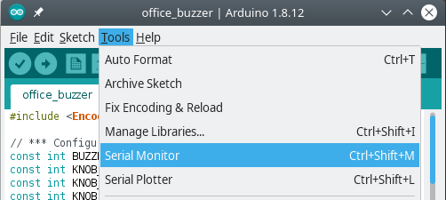
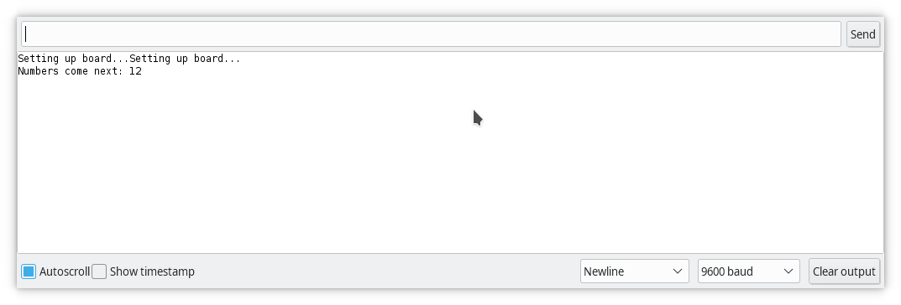

# Hi-tech Buzzer
This week's project is a small device that beeps in constant intervals. It was originally planned as an office prank, after something in my home started beeping with similar properties. It can also be used as a metronome, a counter, etc.


In addition to the buzzer we used last week, we're going to use a *rotary encoder* with a switch. A rotary encoder is a knob you can rotate, and get information about the direction and step of the rotation, there are also absolute encoders, where the readout is the absolute position.

Common uses for knobs (rotary encoders or rotary encoders with potentiometers) are volume controll, light dimmers, etc.
We will use it as an interval regulator.


We will build a device that beeps at a constant interval, a knob will control the interval between beeps: increase or decrease it. The switch button will be used to turn it on or off.

I can think of multiple extensions to this project:
- Use the knob to circle between different frequencies to beep
- Add a random jitter to the interval
- Change the frequency randomly
- Use the switch to control different patters of beeps (it doesnt have to be a single short beep)

Etc.


## Code
The full project is available at [office_buzzer/office_buzzzer.ino](office_buzzer).

### Libraries
In this project, we'll need to install and use an external library to read the values from the rotary encoder. <br />
We'll be using the [Teensy encoder library](https://www.pjrc.com/teensy/td_libs_Encoder.html), and we'll install it using the Library Manager in Arduino IDE.

Go to `Sketch` -> `Include Library` -> `Manage Libraries...` <br />
In Library Manager, seach for `Encoder` from the top right seach box, and install *Encoder* by Paul Stoffregen, v1.4.1


After the library is installed, it can be included into the code:
```c
#include <Encoder.h>
```

### Serial Monitor
Until now, our only communication with Arduino was when we upload a new project. The USB cable we use to power the Arduino can also be used for 2-way communication on the open Serial Port. This is very useful for debugging and also for sending commands to Arduino from your computer (if this is what's needed for your project).


First, in the code we'll open the Serial port, and then we can start writing to it and use the `Serial Monitor` to see the output and send input.

```c
Serial.begin(9600);

// Writing into the Serial port
Serial.begin(9600);
Serial.println("Setting up board...");
Serial.print("Numbers come next: ");
Serial.print(12);
```

This opens the Serial channel on the Arduino side with boud rate of 9600 and then sends a few messages.


To open the Serial Monitor from Arduino IDE, go to `Tools` -> `Serial Monitor`



Once you open it, if you had the lines above running, you should see




## Components
Generic requirements:

- Breadboard
- Arduino
- mini USB cable
- Jumper wires

Project specific needs:
- 100Ω resistor
- Piezo Buzzer
- 5-pin Rotary Encoder

## Circuit Diagram


Notice, that in the diagram, the rotary encoder has only 3 pins, and ours has 5.
I'll try to find (or make) a component that suits our case better.

## Recap
- [ ] Serial Monitor
- [ ] Using libraries
- [ ] Switch
- [ ] Rotary encoder
- [ ] Enums vs int/booleans with limited memory

## Extra Credit
- [ ] Add random jitter to the beep sounds
- [ ] Change the frequency of the beep
