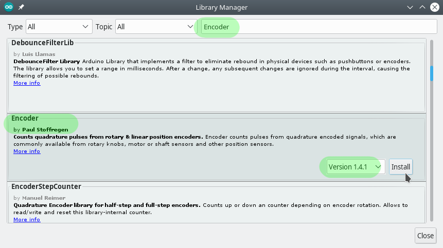
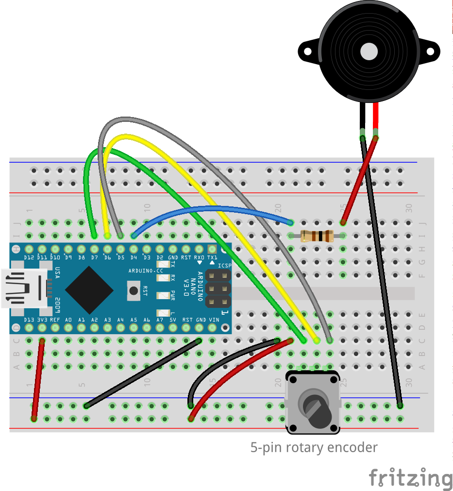

# Hi-tech Buzzer
This weeks project is a small device that beeps in constant intervals. It was originally planned as a prank, after something in my home started beeping with similar properties. It can also be used as a metronome, a counter, etc.

In addition to the buzzer we used last week, we're going to use a *rotary encoder* with a switch. A rotary encoder is a knob you can rotate, and get information about the direction and step of the rotation, there are also absolute encoders, where the readout is the absolute position.

The most common example is a volume knob. We will use it as an interval regulator.

We will build a device, that beeps at a constant interval, and have a rotary encoder to control the interval between beeps: increase or decrease it. The switch will be used to turn it on or off.
I can think of many nice extensions to this project:
- Use the switch circle between different frequencies to beep
- Add a random jitter to the interval
- Change the frequency randomly
- Use the switch to control different patters of beeps (it doesnt have to be a single short beep)

Etc.

## Code
The full project is available at [office_buzzer/office_buzzer.ino](office_buzzer).

In this project, we'll need to install and use an external library to read the values from the rotary encoder.

We'll be using the [Teensy encoder library](https://www.pjrc.com/teensy/td_libs_Encoder.html), and we'll install it using the Library Manager in Arduino IDE.

Go to `Sketch` -> `Include Library` -> `Manage Libraries...`

In Library Manager, seach for `Encoder` from the top right seach box, and install *Encoder* by Paul Stoffregen, v1.4.1

## Components
Generic requirements:

- Breadboard
- Arduino
- mini USB cable
- Jumper wires

Project specific needs:
- 100Ω resistor
- Piezo Buzzer
- 5-pin Rotary Encoder

## Circuit Diagram

Notice, that in the diagram, the rotary encoder has only 3 pins, and ours has 5.
I'll try to find (or make) a component that suits our case better.

## Recap
- [ ] Serial Monitor
- [ ] Using libraries
- [ ] Switch
- [ ] Rotary encoder
- [ ] Enums vs int/booleans with limited memory

## Extra Credit
- [ ] Add random jitter to the beep sounds
- [ ] Change the frequency of the beep
