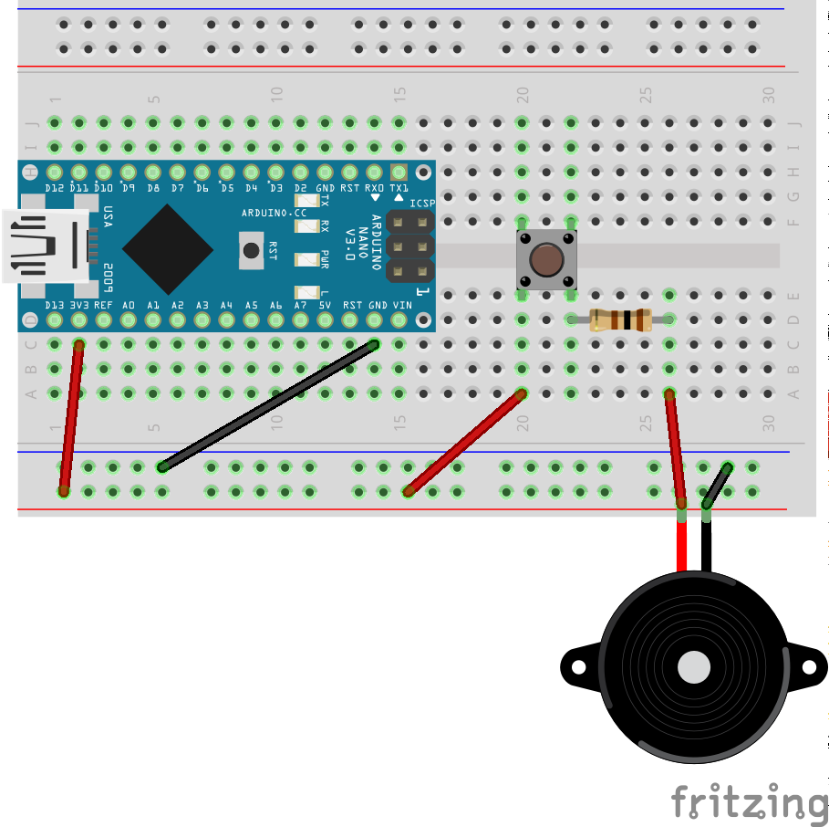

# Music Memory Game
Today we're going to use two new components and make a music memory game. The device will play a tune, and the player will have to repeat it, the longer the tune, the harder it is to keep playing and win!

We will use a buzzer (for the sounds), 4 push buttons for the different tunes and an LED to associate each tune to a different color.

## Push Button
A push button is a mechanical component that can connect (or disconnect) a circuit when pushed.

The photo shows a diagram of a push button on the right, and the schema on the left. When the button is pushed, the switch in the middle makes contact.

To demonstrate how a push button works, we'll build a simple circuit that uses the arduino as a power source.

### Circuit Diagram for Push Button

In this circuit, the buzzer is on the "other" side of the switch, so nothing happens when things are just connected. When you push the button, the switch is closed and current reaches the buzzer and it'll make a sound.

- [ ] TODO: Add pullup configuration for the push button, use it to turn on the on-board LED

Now that we're familiar with all the components, we can proceed to the main project.

## Code
The full project is available at [music_game/music_game.ino](music_game).

## Components
Generic requirements:

- Breadboard
- Arduino
- mini USB cable
- Jumper wires

Project specific needs:
- 1 x RGB LED
- 3 x 470Ω resistor
- Piezo Buzzer
- 1 x 100Ω resistor
- 4 x push buttons, preferrably painted in different colors: red, green, blue and yellow

There are many components this time, and the board will be full of cables.

## Circuit Diagram
This circuit is designed to fit a half breadboard (30 rows), with Arduino Nano connected directly to the breadboard (on rows 1 to 15).  
This is going to look a bit heavy, but the design allocates a clearing in front of the push buttons, to allow convenient manipulation of the buttons (to play the game!).

## Recap
- [ ] Working with a push button
- [ ] RGB LED
- [ ] Debugging programs with Serial Monitor
- [ ] Halting a program and setting the Arduino to sleep

